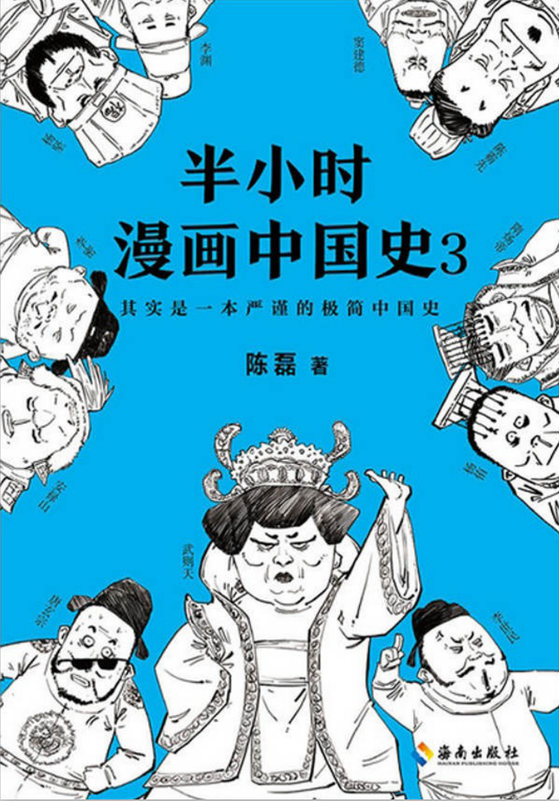
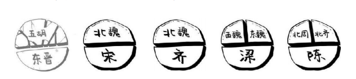

# 《半小时漫画中国史3》——南北朝到大唐 

温馨提示:
南北朝不是一个朝代，而是一堆朝代的合称……

### 北魏，发生过两件大事，第一件事是汉化。
汉化过程中，很多鲜卑姓都改成了汉姓。
> 比如“拓跋”就改成“元”，“独孤”改成“刘”，等等。

当年北周封杨坚为随国公，但杨爸爸不喜欢这个随，于是改成隋。

### 唐朝边境问题
冲到北方去打败东突厥的，是唐朝的大将李靖，对了，就是那个托塔天王的原型。

### 武则天
当然了，武则天也有缺点，这个女人最大的缺点就是心狠手辣。她扎在男人堆里当领导，很害怕有人谋反，所以她天天鼓励大家告密。

张柬之的老腊肉宰相带着小弟，冲进来剁了小鲜肉，逼着武则天赶紧退位。这个事件叫作神龙革命。

就这样，武则天过了一把皇帝瘾，最终还是把大权还给了李家。

> 温馨小贴士
> 
> 唐玄宗李隆基，又称至道大圣大明孝皇帝。到了清朝，康熙皇帝叫玄烨，玄字不让随便喊，这叫避讳，所以自那时候起，大家多喊唐玄宗叫唐明皇。

男人要是不善于处理亲子关系，就要多走心，少走肾，生太多了有生命危险。

德宗之后几乎每个皇帝都计划着收回兵权，可是权力这东西，给出去了，再想要回来……

### 都城
有记载说当时旧长安城“水皆咸卤，不甚宜人”，意思就是八百年来人们新陈代谢的各种产物(请勿想象)渗下去，地下水都成打卤汤了。

居民区和市场都被围墙分别圈起来了，定时开关。这叫市坊分离。

唐朝那会儿还没有后来那么开放，夜生活很不自由，一到晚上全城关闭，各回各家，不许在大街上瞎溜达，这叫**宵禁制**

不过宵禁也有特例，那就是元宵节放三天假，晚上可以出来看花灯